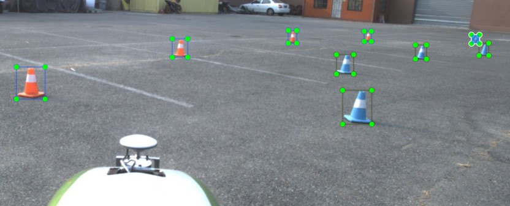

# FSACOCO
Open-Source Dataset for Cones that need to be recognized during the dynamic disciplines of the Formula Student Autonomous China competition.

中文版文档见：[README_cn.md](README_cn.md)

## How to get the datasets

This dataset lives from your contribution. You first need to send your team's dataset to us. After we verify the validity of the dataset, we will send you all the current datasets we have. To promote the growth of the dataset, we have set a minimum contribution amount of 600 images.

## How to send your dataset

In order to solve the problem of transferring large files, we **recommend** https://airportal.cn (<2G) or https://pan.baidu.com/ (>2G) for file upload. Once the upload is completed, you need to manually send the download code to the e-mail address: bitfsd@163.com.

## Annotation Types

### Darknet YOLO

Darknet uses normalized image dimensions for the labels and defines the regions-of-interest (ROI) by their class, mid-point, width and height

```
# darknet-label.txt

0 0.255078125 0.545833333333 0.02421875 0.0583333333333
0 0.41328125 0.613194444444 0.040625 0.081944444444
0 0.81015625 0.780555555556 0.0734375 0.15
```
**Format: \[class index\]\[mid_x\]\[mid_y\]\[width]\[height\]**<br/>

## label tool

There is a labeling tool in tools. Small adaptations for labeling cones and additional functionality on BBox-Label-Tool.<br/>

**Format:**

**[# cones]**

**\[minX\]\[minY\]\[maxX\]\[maxY\]\[labelname\]\[dist_from_width\]\[dist_from_height\]**<br/>

The position is given in absolute pixel values, the distance is calculated in metres.

There is a converter to Darknet YOLO in scripts.


## Datasets Requirement
The label box must be closed to the cone **as close as possible**.  
As shown in the figure below, the cones must meet the rules of FSAC:



## Contributor
List of teams currently participating in dataset construction:

[Beijing Institute of Technology Driverless Racing Team](http://www.bitfsd.com)  

FuZhou University Driverless Racing Team

Beihang University AERO Racing Team

Xihua University Driverless Racing Team

Hunan University Sliver Wing Team

Wuhan University of Science and Technology Chiji Racing Team

Hubei University of Automotive Technology Driverless Racing Team

Changchun University Driverless Racing Team